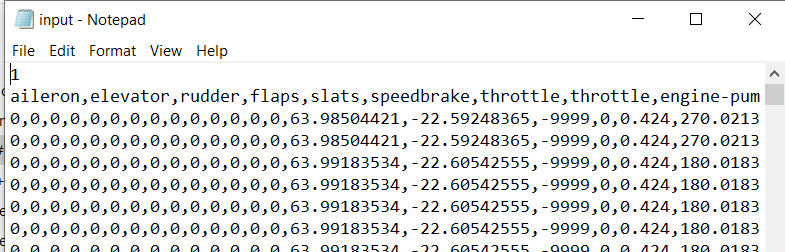
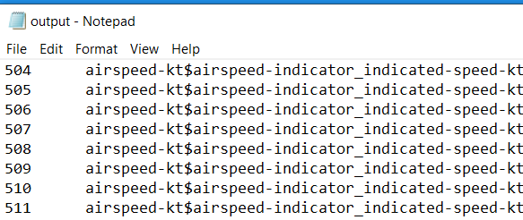

# Flight Inspection App
### General
In this project, we built a GUI (WPF application), which allows us to track the flight of the aircraft and the flight-related data and showing it in various methods, using the MVVM architecture, Client-Server architecture, and parallel programming.

### Emphasis for examiner
- In the CSV file when there were columns with the same name, we added the '2' character to the duplicate column name's when we put it in the dictionary, so that the previous entries would not be overwritten.
- In the display of the original and correlative graphs the ranges are dynamically set according to the entered values, while in the regression line graph we set a static range to support a comfortable display of as many features as possible combined with the last 30 dots marked in blue
- By pressing the "Exit" button on the main window - the FG window will also close with the main window.
- Tip: For better preformence - Wait 5 seconds after pressing "Fly!" on the FG window before starting the simulation - in order for the connection to complete.

- #### dll asumptions
  - The user needs to enter a full path of the dll file to the dedicated window in the application
  - We reduced the threshold value by 10% in the mincircle algorithm, to detect more anomalies
  - To create a new anomaly detection algorithm and use it in a dll, the file must implement an interface that contains a single method called "void findAnomalies ()". The method should load information from the "input.txt" file that contains the standard flight data, and the anomaly flight, and create a file named "output.txt" that contains the exception data in the format specified below.
 - ##### Exception format:
   -  Number of a line in which the anomaly occurred.
   - The names of the attributes where the anomaly occurred are concated with the character '$' between them.
   - After the data, in a separate row the string "Done."

   - ##### Examples:
  
  

### Repositories structure
- Plugins folder - contains the dll files of the minimal circle and the regression line algorithms
- Packages folder - contains the OxyPlot pacages used to draw the graphs in the project
- Combination1 - contains the project code and data:
 - controls - the whole code of the controllers of the project (View, viewModel and Model)
   - FGCommunication
   - Graph
   - Info
   - Joystick
   - timeSlider
  - bin/debug - data files such as flight csv and xml, text files for dll
  - outside of the folders - the images for the buttons (pause, resume and reset),  MainWindow and CSVReader code
- #### dll logic
In order to work with dll files we did as follows:
 - We used 3 methods from the kernel32.dll family -
 - LoadLibrary - Its job is to load the dll file from the full routing
 - GetProcAddress - Its function is to return a pointer to the dll interface method, the findAnomalies method.
 - FreeLibrary - Releases the dll file after we finished using it
After the user enters the file's path into the dll, and presses the load button we used the LoadLibrary method to load the file. We ran GetProcAddress (findAnomalies), which is the method we defined in the dll file interface, and saved it into a pointer.
Then, we called the method and finally released the file. Calling the method caused the flight data stored in the input.txt to be loaded, processed, detect anomalies and write them into the output.txt file.

### Packages requirements
- In order to continue developing the project, the following packages must be installed:
 - OxyPlot.Core.2.0.0
 - OxyPlot.Wpf.2.0.0

### Installing Instructions
- Clone the repo
##### FlightGear Instructions
- Download FlightGear 2020.3.6, and make sure that the shortcut of the app is on the Desktop and named "FlightGear 2020.3.6" Make sure you did the whole installation.
- Add the attached file "playback_small.xml" to "C:\Program Files\FlightGear 2020.3.6\data\Protocol"
- Add in the FlightGear Settings in "Additional Settings" these three lines: 
--generic=socket,in,20,127.0.0.1,5400,tcp,playback_small 
--fdm=null
--generic=socket,out,20,127.0.0.1,6400,tcp,playback_small
- In order to set up the connection with our program.

### Links
- ReadMe of the Main classes - [MainClassesReadme](combination1/MainClassesReadme.md)
- The link to the FlightGear web site - https://www.flightgear.org/
### Video
[The video with sound](Media/FG_Video.mp4) - need to download before watching.

